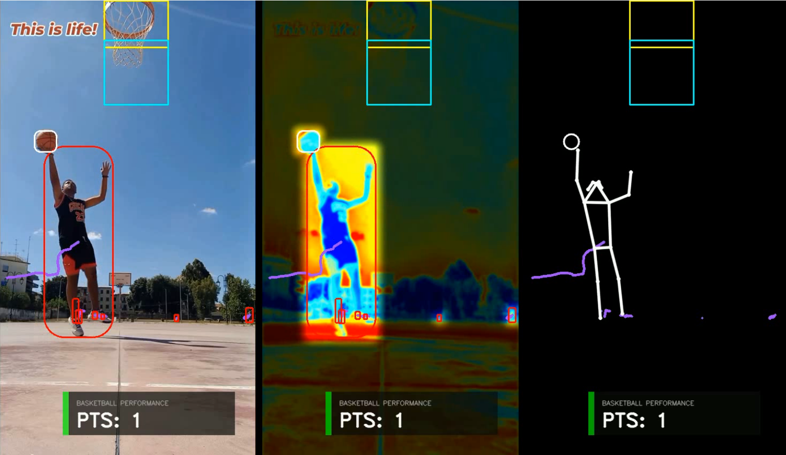

# 🏀 gameVision: AI-Powered Basketball Analytics



**gameVision** is a high-performance computer vision project designed to automate basketball game analysis. By leveraging state-of-the-art object detection and custom tracking logic, this tool provides real-time scoring detection, player tracking, and professional-grade visual overlays.

---

## 🚀 Key Features

* **Intelligent Ball Tracking**: Employs a **Kalman Filter**-based stabilizer to maintain a persistent lock on the basketball, ensuring robust tracking through high-speed movement and temporary occlusions.
* **Automated Scoring Logic**: Features a dual-gate "Hidden Segmentation" system. It automatically identifies the hoop rim using color-based ROI boosting and verifies points using a directional downward-movement check.
* **Professional Visual Overlays**: Utilizes the **Supervision** library to render "broadcast-ready" aesthetic annotations, including rounded bounding boxes and dynamic motion trails.
* **Dynamic Lighting Correction**: Implements a CLAHE-based lighting fix in the LAB color space to ensure detection accuracy remains consistent regardless of court lighting conditions.
* **YOLO11 Integration**: Powered by the `yolo11x-seg` model for high-precision object segmentation and detection.

---

## 🛠️ Tech Stack

* **Core Engine**: [Ultralytics YOLO11](https://github.com/ultralytics/ultralytics)
* **Computer Vision Logic**: [Supervision](https://github.com/roboflow/supervision)
* **Image Processing**: OpenCV, NumPy
* **Tracking**: Kalman Filtering
* **Large File Management**: Git LFS (for `.mp4` video assets and `.pt` model weights)

---

## 📦 Installation & Setup

### 1. Clone the Repository
```bash
git clone [https://github.com/AlviRownok/gameVision.git](https://github.com/AlviRownok/gameVision.git)
cd gameVision

```

### 2. Set up Environment

```bash
# Create a virtual environment
python -m venv venv

# Activate it (Windows)
venv\Scripts\activate

# Install dependencies
pip install -U ultralytics supervision lapx opencv-python numpy tqdm ipywidgets

```

### 3. Initialize Git LFS

Since this project handles large assets, Git LFS is required to pull the video samples and model weights.

```bash
git lfs install
git lfs pull

```

---

## 📖 Usage

The main logic is contained within `GameVision1_0.ipynb`.

1. Place your input video in the designated input directory.
2. Open the notebook in VS Code or Jupyter.
3. Update the `INPUT_VIDEO_PATH` and `OUTPUT_VIDEO_PATH` variables.
4. Run all cells to:
* Initialize the **Auto Hoop Gates** based on rim detection.
* Process the video frame-by-frame with the **Kalman Stabilizer**.
* Export a processed video with score counting and visual traces.


---

## 📊 Results & Visualization

| Feature | Visual Representation |
| --- | --- |
| **Ball Trails** | White aesthetic traces showing the trajectory of shots. |
| **Scoring** | Automated score counter triggered by hoop gate logic. |
| **Player Detection** | Red rounded boxes for player identification and isolation. |

---

## 🛠️ Future Roadmap

* Multi-camera support for 3D trajectory mapping.
* Player performance heatmaps (Shot charts).
* Real-time integration for live-streaming analysis.

---

*Developed as part of the "Projects For Fun" Computer Vision series.*

---